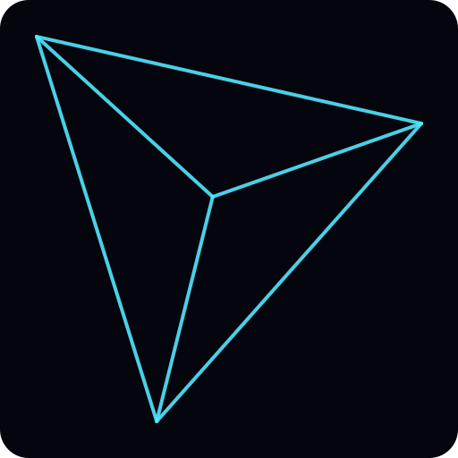
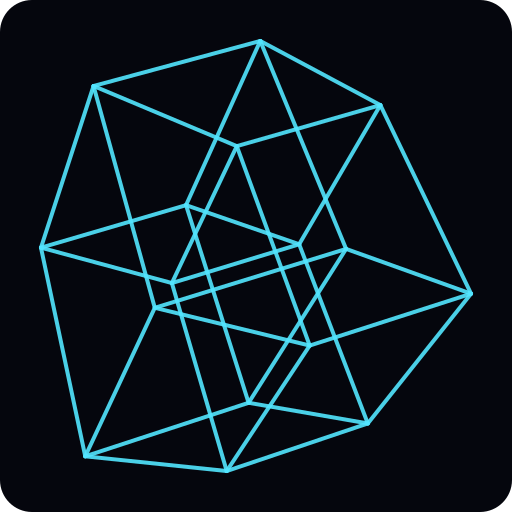
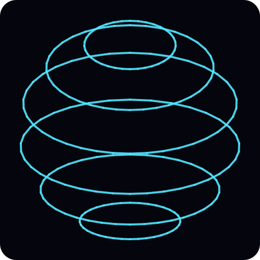
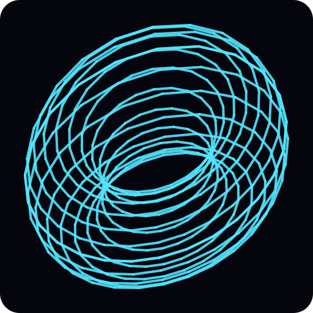
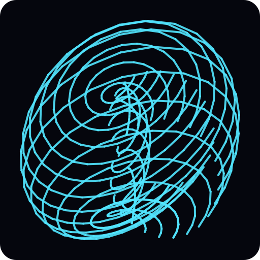
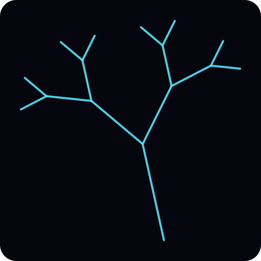
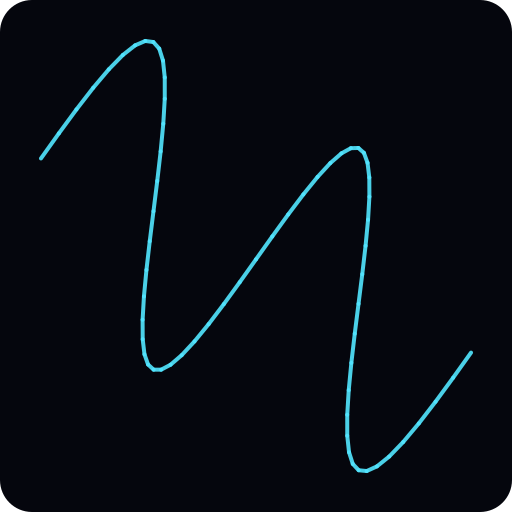
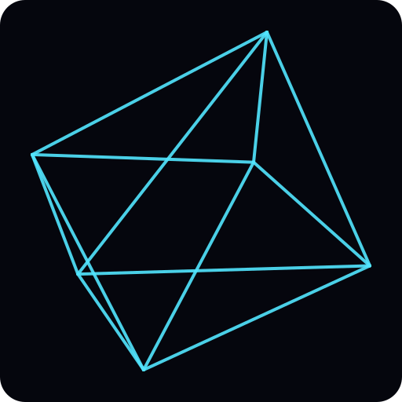
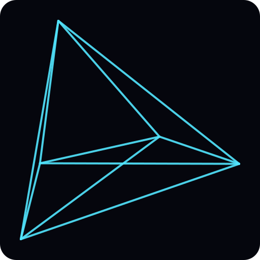
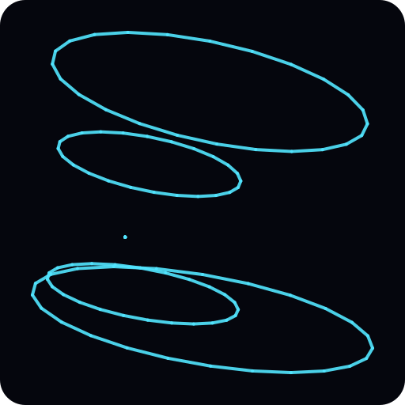

# Geometry Preset Compendium

> This file is generated by `npm run geometry:report`. Do not edit manually.

Report generated on 2025-10-10T16:32:33.875Z.

## Summary

| Metric | Value |
| --- | ---: |
| Geometry families | 10 |
| Total preset slots | 38 |
| Icon manifest entries | 10 |

## Geometry Overview

| Index | Geometry | Preset slots | Icon |
| ---: | --- | ---: | --- |
| 0 | Tetrahedron | 4 |  |
| 1 | Hypercube | 4 |  |
| 2 | Sphere | 4 |  |
| 3 | Torus | 4 |  |
| 4 | Klein Bottle | 4 |  |
| 5 | Fractal | 3 |  |
| 6 | Wave | 3 |  |
| 7 | Crystal | 4 |  |
| 8 | Hypertetrahedron | 4 |  |
| 9 | Hypersphere | 4 |  |

## 0 — Tetrahedron

- **Preset slots:** 4
- **Global preset indices:** 1–4
- **Icon file:** [00-tetrahedron.svg](../docs/geometry-icons/00-tetrahedron.svg)
- **Icon segments:** 6
- **Preset labels:**
  - 01 · TETRAHEDRON LATTICE 1
  - 02 · TETRAHEDRON LATTICE 2
  - 03 · TETRAHEDRON LATTICE 3
  - 04 · TETRAHEDRON LATTICE 4
- **Parameter envelopes:**
  - Grid density: 9.60 – 24
  - Morph factor: 0.45 – 1.26
  - Chaos: 0 – 0.45
  - Speed: 0.80 – 1.40
  - Hue: 0 – 45
  - XW rotation: -0.60 – 0.60
  - YW rotation: 0
  - ZW rotation: 0 – 0.40
  - Dimension: 3.20 – 3.74

## 1 — Hypercube

- **Preset slots:** 4
- **Global preset indices:** 5–8
- **Icon file:** [01-hypercube.svg](../docs/geometry-icons/01-hypercube.svg)
- **Icon segments:** 32
- **Preset labels:**
  - 01 · HYPERCUBE LATTICE 1
  - 02 · HYPERCUBE LATTICE 2
  - 03 · HYPERCUBE LATTICE 3
  - 04 · HYPERCUBE LATTICE 4
- **Parameter envelopes:**
  - Grid density: 8 – 20
  - Morph factor: 0.40 – 1.12
  - Chaos: 0 – 0.45
  - Speed: 0.80 – 1.40
  - Hue: 45 – 90
  - XW rotation: -0.60 – 0.60
  - YW rotation: 0.30
  - ZW rotation: 0 – 0.40
  - Dimension: 3.20 – 3.74

## 2 — Sphere

- **Preset slots:** 4
- **Global preset indices:** 9–12
- **Icon file:** [02-sphere.svg](../docs/geometry-icons/02-sphere.svg)
- **Icon segments:** 216
- **Preset labels:**
  - 01 · SPHERE LATTICE 1
  - 02 · SPHERE LATTICE 2
  - 03 · SPHERE LATTICE 3
  - 04 · SPHERE LATTICE 4
- **Parameter envelopes:**
  - Grid density: 8 – 20
  - Morph factor: 0.50 – 1.40
  - Chaos: 0 – 0.67
  - Speed: 0.80 – 1.40
  - Hue: 90 – 135
  - XW rotation: -0.60 – 0.60
  - YW rotation: 0
  - ZW rotation: 0 – 0.40
  - Dimension: 3.25 – 3.79

## 3 — Torus

- **Preset slots:** 4
- **Global preset indices:** 13–16
- **Icon file:** [03-torus.svg](../docs/geometry-icons/03-torus.svg)
- **Icon segments:** 456
- **Preset labels:**
  - 01 · TORUS LATTICE 1
  - 02 · TORUS LATTICE 2
  - 03 · TORUS LATTICE 3
  - 04 · TORUS LATTICE 4
- **Parameter envelopes:**
  - Grid density: 8 – 20
  - Morph factor: 0.50 – 1.40
  - Chaos: 0 – 0.45
  - Speed: 1.04 – 1.82
  - Hue: 135 – 180
  - XW rotation: -0.55 – 0.65
  - YW rotation: 0.25
  - ZW rotation: 0 – 0.40
  - Dimension: 3.20 – 3.74

## 4 — Klein Bottle

- **Preset slots:** 4
- **Global preset indices:** 17–20
- **Icon file:** [04-klein-bottle.svg](../docs/geometry-icons/04-klein-bottle.svg)
- **Icon segments:** 700
- **Preset labels:**
  - 01 · KLEIN BOTTLE LATTICE 1
  - 02 · KLEIN BOTTLE LATTICE 2
  - 03 · KLEIN BOTTLE LATTICE 3
  - 04 · KLEIN BOTTLE LATTICE 4
- **Parameter envelopes:**
  - Grid density: 5.60 – 14
  - Morph factor: 0.70 – 1.96
  - Chaos: 0 – 0.45
  - Speed: 0.80 – 1.40
  - Hue: 180 – 225
  - XW rotation: -0.60 – 0.60
  - YW rotation: 0
  - ZW rotation: 0.05 – 0.45
  - Dimension: 3.20 – 3.74

## 5 — Fractal

- **Preset slots:** 3
- **Global preset indices:** 21–23
- **Icon file:** [05-fractal.svg](../docs/geometry-icons/05-fractal.svg)
- **Icon segments:** 15
- **Preset labels:**
  - 01 · FRACTAL LATTICE 1
  - 02 · FRACTAL LATTICE 2
  - 03 · FRACTAL LATTICE 3
- **Parameter envelopes:**
  - Grid density: 4.80 – 9.60
  - Morph factor: 0.50 – 1.10
  - Chaos: 0 – 0.60
  - Speed: 0.80 – 1.20
  - Hue: 225 – 255
  - XW rotation: -0.50 – 0.30
  - YW rotation: 0.25
  - ZW rotation: 0 – 0.40
  - Dimension: 3.20 – 3.56

## 6 — Wave

- **Preset slots:** 3
- **Global preset indices:** 24–26
- **Icon file:** [06-wave.svg](../docs/geometry-icons/06-wave.svg)
- **Icon segments:** 64
- **Preset labels:**
  - 01 · WAVE LATTICE 1
  - 02 · WAVE LATTICE 2
  - 03 · WAVE LATTICE 3
- **Parameter envelopes:**
  - Grid density: 8 – 16
  - Morph factor: 0.50 – 1.10
  - Chaos: 0 – 0.15
  - Speed: 1.28 – 1.92
  - Hue: 270 – 300
  - XW rotation: -0.60 – 0.20
  - YW rotation: 0.10
  - ZW rotation: 0 – 0.40
  - Dimension: 3.20 – 3.56

## 7 — Crystal

- **Preset slots:** 4
- **Global preset indices:** 27–30
- **Icon file:** [07-crystal.svg](../docs/geometry-icons/07-crystal.svg)
- **Icon segments:** 12
- **Preset labels:**
  - 01 · CRYSTAL LATTICE 1
  - 02 · CRYSTAL LATTICE 2
  - 03 · CRYSTAL LATTICE 3
  - 04 · CRYSTAL LATTICE 4
- **Parameter envelopes:**
  - Grid density: 12 – 30
  - Morph factor: 0.30 – 0.84
  - Chaos: 0 – 0.45
  - Speed: 0.80 – 1.40
  - Hue: 0 – 345
  - XW rotation: -0.60 – 0.60
  - YW rotation: 0.25
  - ZW rotation: 0.05 – 0.45
  - Dimension: 3.20 – 3.74

## 8 — Hypertetrahedron

- **Preset slots:** 4
- **Global preset indices:** 31–34
- **Icon file:** [08-hypertetrahedron.svg](../docs/geometry-icons/08-hypertetrahedron.svg)
- **Icon segments:** 10
- **Preset labels:**
  - 01 · HYPERTETRAHEDRON LATTICE 1
  - 02 · HYPERTETRAHEDRON LATTICE 2
  - 03 · HYPERTETRAHEDRON LATTICE 3
  - 04 · HYPERTETRAHEDRON LATTICE 4
- **Parameter envelopes:**
  - Grid density: 10 – 25
  - Morph factor: 0.38 – 1.05
  - Chaos: 0 – 0.45
  - Speed: 0.80 – 1.40
  - Hue: 0 – 45
  - XW rotation: -0.60 – 0.60
  - YW rotation: -0.22 – 0.22
  - ZW rotation: 0.10 – 0.50
  - Dimension: 3.28 – 3.82

## 9 — Hypersphere

- **Preset slots:** 4
- **Global preset indices:** 35–38
- **Icon file:** [09-hypersphere.svg](../docs/geometry-icons/09-hypersphere.svg)
- **Icon segments:** 120
- **Preset labels:**
  - 01 · HYPERSPHERE LATTICE 1
  - 02 · HYPERSPHERE LATTICE 2
  - 03 · HYPERSPHERE LATTICE 3
  - 04 · HYPERSPHERE LATTICE 4
- **Parameter envelopes:**
  - Grid density: 6.80 – 17
  - Morph factor: 0.50 – 1.40
  - Chaos: 0 – 0.63
  - Speed: 0.88 – 1.54
  - Hue: 45 – 90
  - XW rotation: -0.40 – 0.80
  - YW rotation: 0.25
  - ZW rotation: 0 – 0.40
  - Dimension: 3.32 – 3.86

